# System Architecture - Campus Recruitment Portal

## 🏗️ High-Level Architecture

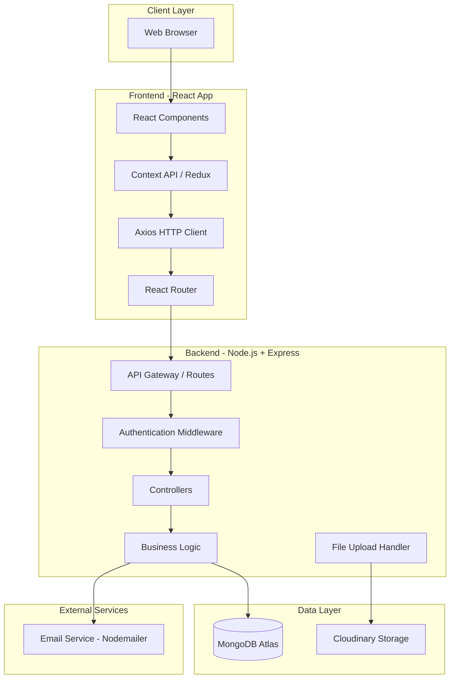

## 🔄 Request Flow

### Authentication Flow

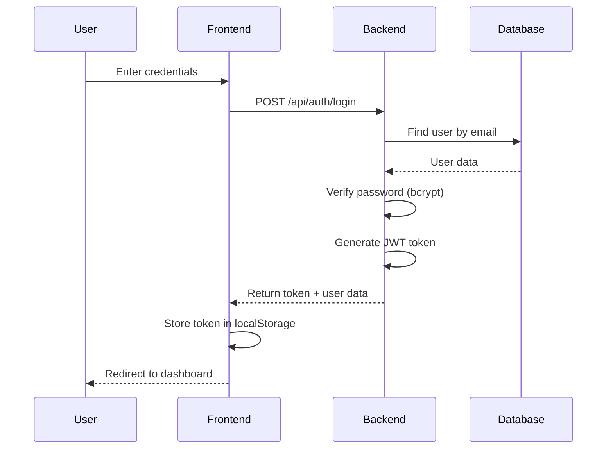

### Job Application Flow

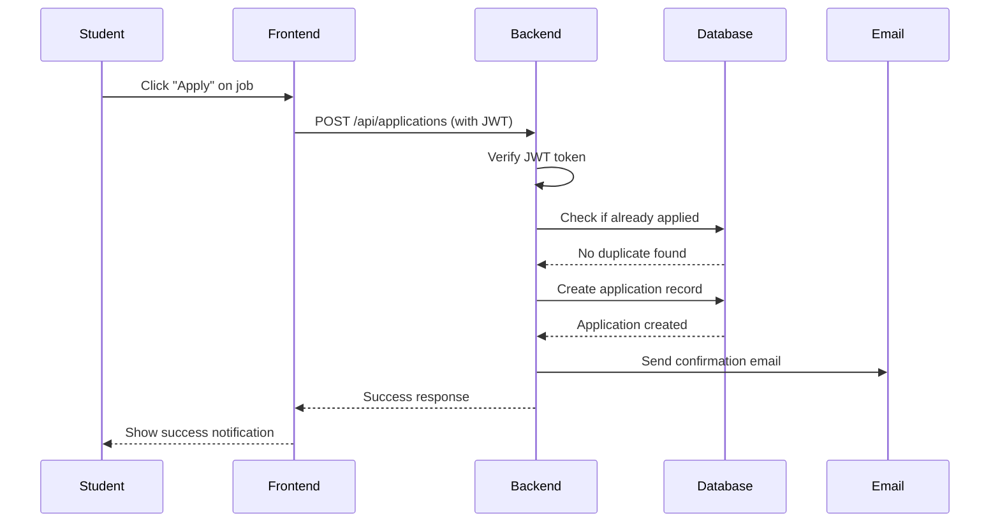

### Resume Upload Flow

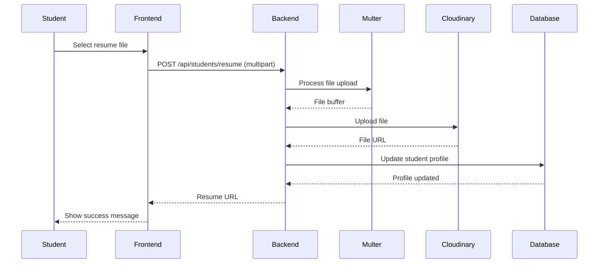

## 🎯 Component Architecture

### Frontend Components

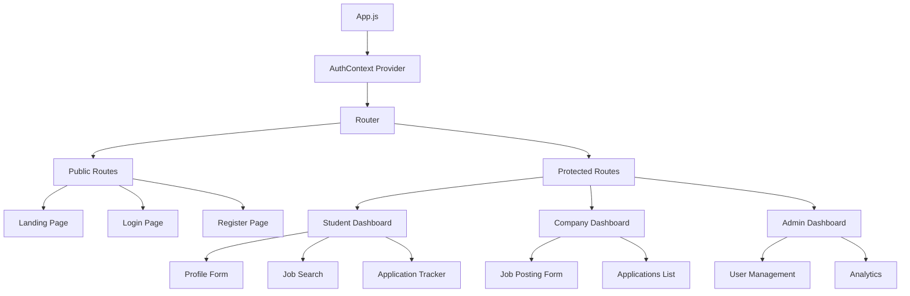

### Backend Architecture

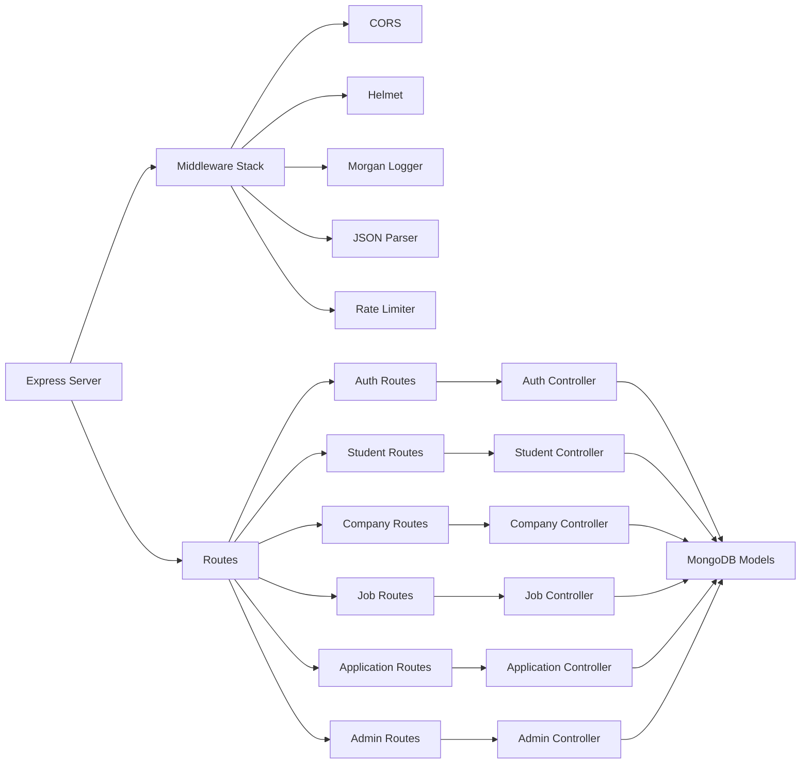

## 🔒 Security Architecture

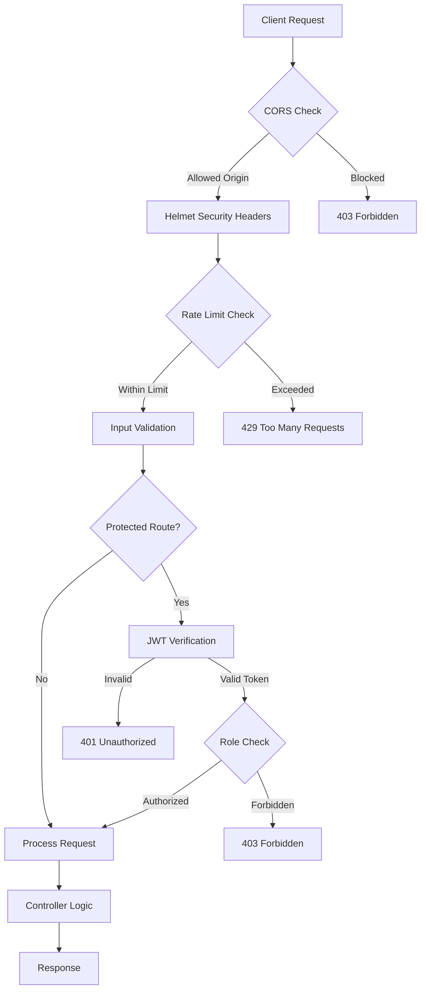

## 📊 Data Flow

### Student Registration to Job Application

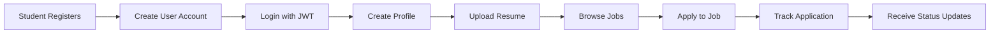

### Company Job Posting to Hiring

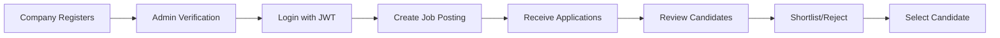

## 🌐 Deployment Architecture

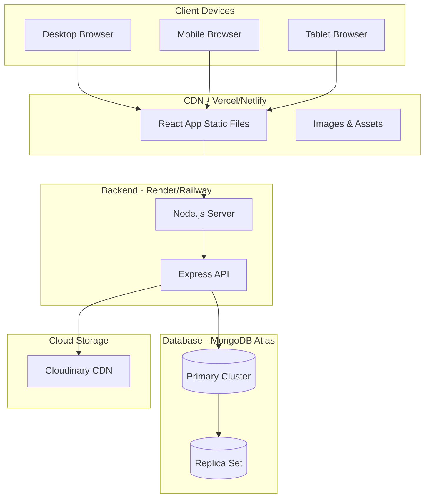

## 🔄 State Management

### Frontend State Flow (Context API)

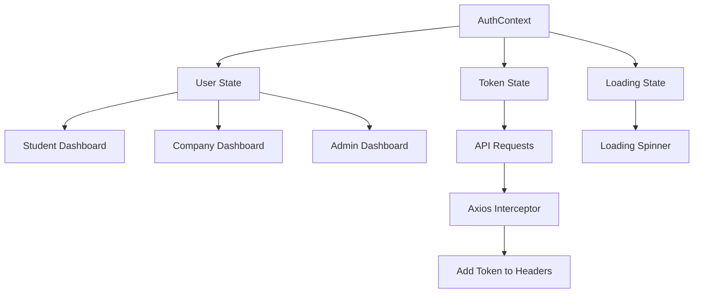

## 📡 API Layer

### RESTful API Design

```mermaid
graph LR
    A[Frontend] -->|HTTP Requests| B[API Gateway]
    B --> C[/api/auth]
    B --> D[/api/students]
    B --> E[/api/companies]
    B --> F[/api/jobs]
    B --> G[/api/applications]
    B --> H[/api/admin]
    
    C --> I[Auth Controller]
    D --> J[Student Controller]
    E --> K[Company Controller]
    F --> L[Job Controller]
    G --> M[Application Controller]
    H --> N[Admin Controller]
    
    I --> O[(Database)]
    J --> O
    K --> O
    L --> O
    M --> O
    N --> O
```

## 🔍 Scalability Considerations

### Current Architecture (MVP)
- **Frontend:** Single React app on Vercel
- **Backend:** Single Node.js server on Render
- **Database:** MongoDB Atlas (shared cluster)
- **File Storage:** Cloudinary free tier

### Future Scalability (Production)

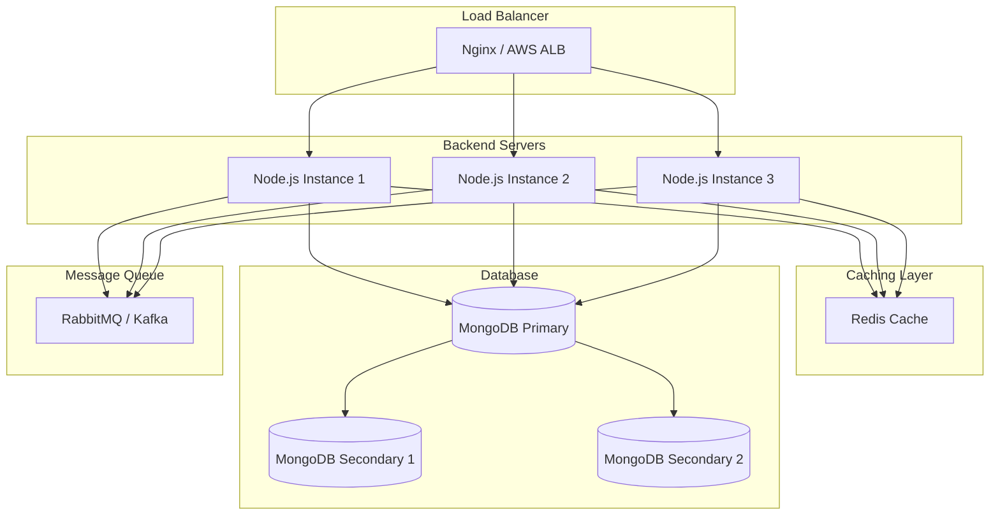

## 🛡️ Error Handling Flow

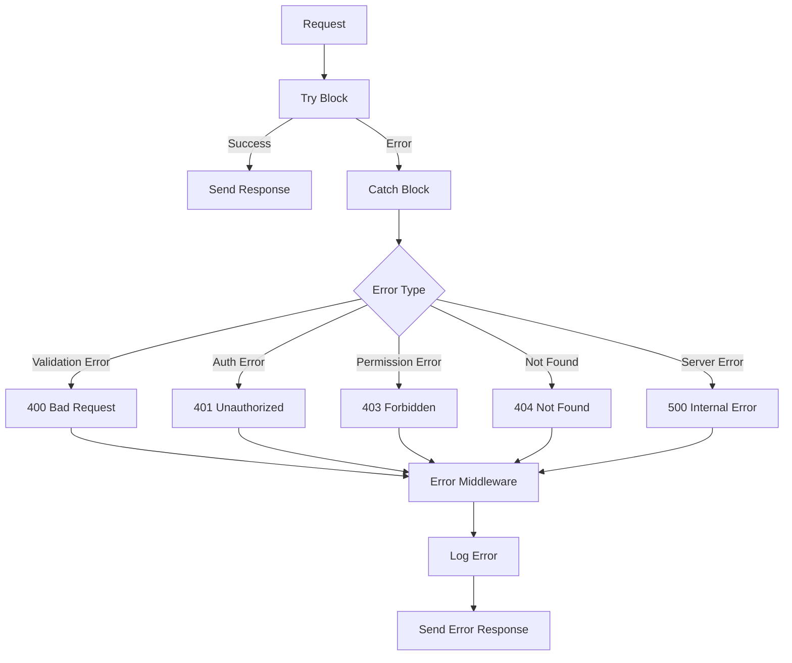

## 📈 Performance Optimization

### Optimization Strategies

1. **Database:**
   - Indexing on frequently queried fields
   - Query optimization with projections
   - Connection pooling

2. **Backend:**
   - Response compression (gzip)
   - Caching with Redis
   - Pagination for large datasets

3. **Frontend:**
   - Code splitting
   - Lazy loading components
   - Image optimization
   - Memoization (React.memo, useMemo)

4. **Network:**
   - CDN for static assets
   - HTTP/2
   - Minification and bundling

## 🔐 Authentication Architecture

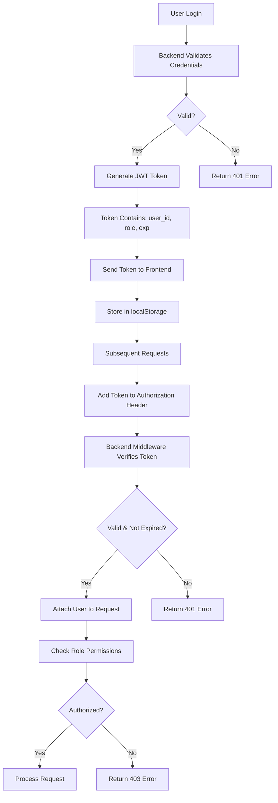

## 💡 Key Architectural Decisions

### Why This Architecture?

1. **Separation of Concerns:** Frontend and backend are decoupled
2. **Scalability:** Each layer can scale independently
3. **Maintainability:** Clear structure makes code easy to understand
4. **Security:** Multiple layers of protection (JWT, CORS, rate limiting)
5. **Performance:** CDN, caching, and optimization strategies
6. **Cost-Effective:** Uses free tiers for MVP, easy to upgrade

### Trade-offs

| Decision | Benefit | Trade-off |
|----------|---------|-----------|
| MongoDB | Flexible schema | No ACID transactions |
| JWT | Stateless, scalable | Can't revoke tokens easily |
| Cloudinary | Easy file management | Vendor lock-in |
| Context API | Simple state management | Not ideal for very large apps |
| Vercel/Render | Easy deployment | Less control than AWS |

---

**Last Updated:** February 2024  
**Version:** 1.0
